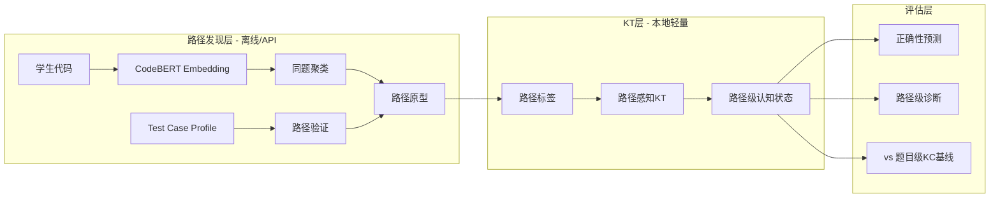

# Path-Aware Code-KT 研究路线图：可执行研究资产

> 基于用户研究资产现状（M4 Pro, 无GPU训练能力）重新定位

---

## 一、研究主线重新定位

### 核心主张（一句话）

> **同一道编程题存在多种解法路径；学生代码中的路径级认知证据（解法结构、test-case行为、错误模式）优于题目级二值标签，能更精确地更新学生认知状态。**

### 为什么这条线比"Reasoning-Enhanced"更适合你

| 维度 | Reasoning-Enhanced (旧) | Path-Aware (新) |
|------|------------------------|-----------------|
| 计算需求 | 需要Llama-3训练 | 可用预训练模型推理+聚类（M4 Pro可跑） |
| 创新定位 | 方法改进（加推理模块） | **问题定义创新**（路径作为中间变量） |
| 评审风险 | "模型拼接"质疑 | 认知主张+实证验证，更像研究 |
| 文献空白 | Thinking-KT已做通用版 | **无人做完整的路径感知code-KT** |
| 你的优势 | 需要大算力 | KCGen-KT的KC生成能力可直接复用 |

---

## 二、Gap Matrix（已做/未做矩阵）

| 研究环节 | 已有工作 | 做到了什么 | 还缺什么 |
|----------|----------|-----------|----------|
| 代码 → 表征 | Code-DKT, CodeLKT, srcML-DKT | 代码向量比二值标签更有信息 | 没有区分"同题不同解法"的表征 |
| 代码 → KC | KC-Finder, Pattern-based KC, KCGen-KT | AST模式/LLM可发现KC | KC是题目级的，不是路径级的 |
| Test case → 信号 | TIKTOC | test case通过率比整体正确性更细 | 没有把test case profile映射到路径 |
| 错误 → 诊断 | McMining, LogicalErrorID | 可以自动识别misconception类型 | 没有接入KT状态更新 |
| 解法过程 → 建模 | BAIM (Polya四阶段) | 数学题有效 | **编程题未做，多解性未建模** |
| 路径 → KT状态 | — | — | **完全空白** |
| 路径 → 推荐 | KDG-Rec (题目级) | 双GNN+偏好解耦 | 用的是题目KC，不是路径状态 |

### 你的切入：填补 "路径 → KT状态" 这个空白环节

---

## 三、可行技术方案（M4 Pro约束下）

### 约束条件
- 无GPU训练能力（Apple Silicon最多跑7B量化推理）
- 可以调用API（GPT-4o/DeepSeek等）做标注/分析
- 可以跑轻量级聚类、统计分析、DKT/BKT等传统KT模型
- 有CodeWorkout数据集（246学生，50题，39K交互，含实际代码）

### 方案A：路径识别 + 传统KT（最低算力，最快出成果）

```
Pipeline:
1. 代码 → AST/CodeBERT embedding（用预训练模型，不训练）
2. 同题代码聚类 → 路径原型发现（K-means/层次聚类）
3. test case profile + 错误模式 → 路径验证标签
4. 路径标签 → 传统KT模型（BKT/DKT/SAKT）
5. 对比：题目级KC vs 路径级标签 的预测增益
```

**M4 Pro可行性**：全程可在CPU上完成，embedding用HuggingFace本地推理

### 方案B：LLM标注路径 + 路径感知KT（API+本地分析）

```
Pipeline:
1. 每道题的正确代码 → GPT-4o分析解法策略分类
2. 学生代码 → GPT-4o判断属于哪个策略+哪类错误
3. 构建"路径-KC"二层结构
4. 路径感知KT：学生状态 = f(路径选择历史, 路径内KC掌握)
5. 对比：单层KC vs 二层路径-KC 的预测/解释增益
```

**M4 Pro可行性**：GPT-4o API调用 + 本地pandas/sklearn分析

### 方案C：BAIM思路迁移到编程（理论最强）

```
Pipeline:
1. 借鉴BAIM的Polya四阶段分解 → 适配编程：
   - Understand: 学生是否理解题意（从第一次提交判断）
   - Plan: 学生选择的算法策略（从代码结构判断）
   - Carry Out: 实现质量（从bug类型判断）
   - Look Back: 修正能力（从多次提交演变判断）
2. 每个阶段独立追踪mastery
3. Context-conditioned routing → 哪个阶段最能解释当前学生
```

**M4 Pro可行性**：阶段分解用LLM API，routing机制用轻量MLP

---

## 四、最小可发表版本（MVP论文）

### 标题方向
**"Path-Aware Knowledge Tracing for Programming: Beyond Binary Correctness to Solution Strategy Modeling"**

### 问题定义（3句话）
1. 编程题允许多种解法路径，但现有code-KT将所有正确代码视为等价
2. 不同路径激活不同KC子集，反映不同认知状态
3. 我们提出路径感知KT：显式建模解法路径选择，实现细粒度认知诊断

### 方法框架（适合M4 Pro）



### 实验设计

| 实验 | 目的 | 具体做法 |
|------|------|----------|
| RQ1: 路径是否存在 | 验证同题多路径 | 聚类分析+人工检验 |
| RQ2: 路径是否有增量 | 路径标签 vs KC标签 | DKT对比实验 |
| RQ3: 粒度影响 | 不同聚类数的效果 | K=2,3,5,8消融 |
| RQ4: 路径来源 | 代码结构 vs test case vs 错误 | 三种路径定义的对比 |
| RQ5: 可解释性 | 路径是否对应有意义的策略 | 人工评估+案例分析 |

### 所需数据（已有）
- CodeWorkout: 50题, 246学生, 39K交互, **含完整代码**
- 基线KC: 18个人工标注KC
- KCGen-KT生成的50个自动KC

---

## 五、可直接产出的研究资产（让Opus帮你做的）

### 1. Path Annotation Handbook（路径标注手册）

**内容**：
- 路径的操作性定义（可重复识别的解法/错法机制）
- 路径代理变量的三种来源：
  1. **代码结构相似性**：AST子树模式/CodeBERT embedding聚类
  2. **功能行为相似性**：test case通过/失败profile
  3. **错误模式相似性**：同类bug/misconception
- 每道CodeWorkout题的路径标注示例（5-10题）
- 路径粒度选择的指导原则

### 2. Reliable Benchmark Spec（无泄漏实验协议）

**内容**：
- 时间戳严格排序验证
- 学生级划分（不是交互级）
- 序列构造规范（max_len=20的合理性）
- 重复提交处理策略
- Reliable-PKT论文中指出的陷阱清单及对应规避措施

### 3. Research Gap Matrix（上面第二节的正式版）

### 4. Reviewer Objection Pack（审稿预防包）

| 预期质疑 | 预备回应 |
|----------|----------|
| "路径标签可靠吗" | 三种代理变量交叉验证；不追求唯一真路径 |
| "就是模型拼接" | 研究问题是"路径是否有独立增量"，方法只是服务件 |
| "code embedding baseline已包含路径信息" | 消融实验：同embedding下加/不加路径标签 |
| "为什么不是KC够细就行" | 实验对比：50KC vs 路径标签，证明维度不同 |
| "数据规模太小" | CodeWorkout是PKT领域标准数据集，同行均用 |

### 5. Paper Kit（论文骨架）

**版本A：KT主线**
- 标题：Path-Aware Code-KT
- 投稿：EDM/LAK/AIED

**版本B：KC发现主线**
- 标题：Solution-Path-Based KC Discovery
- 投稿：L@S/SIGCSE

**版本C：推荐扩展**
- 标题：Path-Aware Programming Exercise Recommendation
- 投稿：UMAP/RecSys Education

---

## 六、近期执行计划（适配M4 Pro）

### 第一步：路径存在性验证（1-2周工作量）

```
任务：
1. 从CodeWorkout中选10道有足够提交的题目
2. 对每道题的正确代码做CodeBERT embedding + 聚类
3. 人工检查聚类是否对应不同解法策略
4. 对每道题的错误代码做聚类，检查是否对应不同错法

产出：
- 路径存在性的定量证据（聚类质量指标）
- 5-10道题的路径标注示例
- Path Annotation Handbook初稿
```

### 第二步：路径标签 vs KC标签 对比（2-3周工作量）

```
任务：
1. 为全部50题构建路径标签（聚类+API辅助）
2. 用路径标签替代/补充KC标签跑DKT
3. 对比预测性能（AUC/F1）
4. 分析：路径标签在哪些题/学生上更有增量

产出：
- 核心实验结果
- 论文Table 1 的雏形
```

### 第三步：论文写作 + 路径来源消融（2-3周工作量）

```
任务：
1. 对比三种路径定义（代码结构/test case/错误模式）
2. 写论文初稿
3. 补充可解释性案例分析

产出：
- 完整论文初稿
```

---

## 七、关键参考文献补充

### 路径/解法建模
- **BAIM** (arXiv 2604.08260, 2026): Procedural solution representation + context-conditioned routing
- **SolveRank** (EMNLP Findings 2025): Solution-aware retrieval for competitive programming
- **KC-Finder** (EDM 2023): Data-driven KC discovery from code, 明确提到多解性问题

### Pattern-based KC
- **Pattern-based KC Extraction** (arXiv 2508.09281, 2025): AST subtree → VAE → K-means → pattern KCs
- **KCGen-KT** (arXiv 2502.18632, 你的工作): LLM-generated KCs outperform human KCs

### 编程KT可靠性
- **Reliable-PKT** (arXiv 2605.04727, 2026): 评估协议偏差会放大收益
- **Code-DKT**: 代码表征 vs 纯二值标签
- **TIKTOC**: Test case级别监督优于整体correctness

### 编程错误/Misconception
- **McMining**: 从代码中挖掘misconception
- **Automated Logical Error Identification**: 可解释AST模型识别逻辑错误
- **CoderAgent** (arXiv 2505.20642, 2025): PTOT框架模拟学生迭代编程过程
